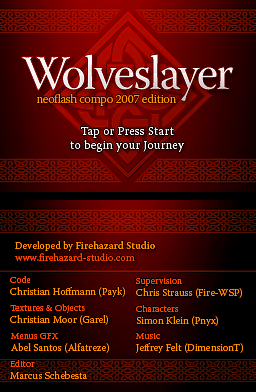
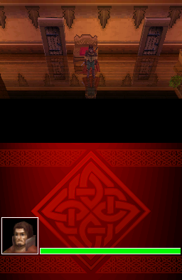
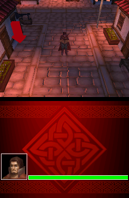
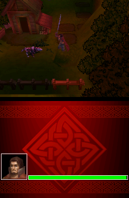
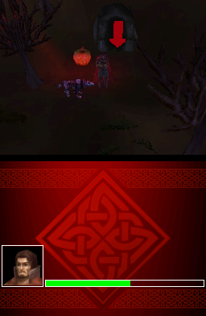
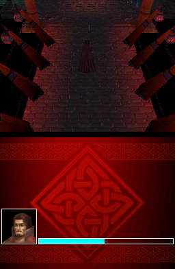

# WolveSlayer

WolveSlayer is a 3D hack'n'slash game for the Nintendo DS released in 2007. It
got the 1st place of the [NEO Spring Coding Compo 2007](https://web.archive.org/web/20210208021659/https://www.neoflash.com/forum/index.php?topic=3895.0)
in the category of GBA/NDS Game.

The [original WolveSlayer](https://web.archive.org/web/20161225102440/http://payk.drunkencoders.com/)
was built for the toolchain and libraries available in 2007. Everything has
changed a lot since then (especially libnds). This repository is a port of the
game to BlocksDS, which has required heavy modifications of the original code.

The main difference for players of the game is that it is no longer needed to
copy the `wolveslayer` folder to the root of the SD card. It is enough to copy
the `.nds` file and load it with a loader that supports the `argv` protocol and
DLDI patching.

 
 
 

## Guide

The objective of this game is to find and slay the boss wolf. You will find
several enemies along the way.

- D-Pad: Move character.
- A: Open doors (only one door in the game!).
- B: Attack (in areas with enemies).

The original developer recorded a video of himself beating the game, you can
watch it [here](https://www.youtube.com/watch?v=q-SZ4lWB1Qs).

## Build instructions

Install [BlocksDS](https://blocksds.github.io/docs/).

Run `make` in the root of this repository.

## Credits

Developed by [Firehazard Studio](www.firehazard-studio.com)

- Code: Christian Hoffmann ([Payk](www.payk.drunkencoders.com))
- Textures & Objects: Christian Moor (Garel)
- Menus GFX: Abel Santos (Alfatreze)
- Editor: Marcus Schebesta
- Supervision: Chris Strauss (Fire-WSP)
- Characters: Simon Klein (Pnyx)
- Music: Jeffrey Felt (DimensionT)

Thanks to:

- Dovoto & WinterMute: For libnds.
- Chishm & GPF: For filesystems.
- Liranuna: For his modplayer sourcecode.
- Webez, Gabebear & Dovoto: For many 3D hints.
- Dovoto: For hosting my page too.
- Alfatreze: For menus, graphics and webpage layout.

Port to BlocksDS by AntonioND.
